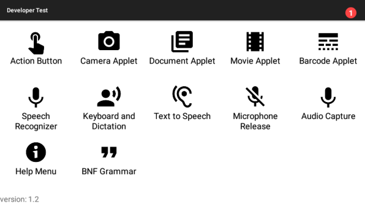

## Installation

The Developer Examples app is available to download as an APK which can be installed to the HMT-1.

[Download Zip](https://realwear.box.com/shared/static/63qvhoxvgf3xjl059myk8k04akios0f0.zip)

Install the Developer Examples app on a HMT-1 following the [install instructions](/installing-apks).

The app contains a number of examples which can be viewed by following the instructions on the screen. Information about each example can be found below with a link to its source code.

## Examples

The following examples are available within the app. Each example has source code and documentation available detailing each one was achieved. 

- ## Action Button
  ### [Source code](https://github.com/realwear/Developer-Examples/blob/master/hmt1developerexamples/src/main/java/com/realwear/hmt1developerexamples/ActionButtonActivity.java) - [Documentation](examples/action-button)    
    This example shows how to take control of the action button on the HMT-1 from inside your application, allowing a developer to trigger events when the user pushes the button.
- ## Camera Applet
  ### [Source code](https://github.com/realwear/Developer-Examples/blob/master/hmt1developerexamples/src/main/java/com/realwear/hmt1developerexamples/CameraActivity.java) - [Documentation](examples/camera-applet)
    This example shows how launch a camera from an application and how to display the picture the user takes.	
- ## Document Applet
  ### [Source code](https://github.com/realwear/Developer-Examples/blob/master/hmt1developerexamples/src/main/java/com/realwear/hmt1developerexamples/DocumentActivity.java) - [Documentation](examples/document-applet)
    This example shows how to open documents and images in the document viewer from an application.
- ## Movie Applet
  ### [Source code](https://github.com/realwear/Developer-Examples/blob/master/hmt1developerexamples/src/main/java/com/realwear/hmt1developerexamples/MovieActivity.java) - [Documentation](examples/movie-applet)
    This example shows how to open videos in the movie viewer from an application.
- ## Barcode Applet
  ### [Source code](https://github.com/realwear/Developer-Examples/blob/master/hmt1developerexamples/src/main/java/com/realwear/hmt1developerexamples/BarcodeActivity.java) - [Documentation](examples/barcode-applet)    
    This example shows how launch a barcode scanner from an application and how to read the response once the user has scanned a code.	
- ## Speech Recognizer
  ### [Source code](https://github.com/realwear/Developer-Examples/blob/master/hmt1developerexamples/src/main/java/com/realwear/hmt1developerexamples/SpeechRecognizerActivity.java) - [Documentation](examples/speech-recognizer)
    This example shows how to programmatically add voice commands to an application. 
- ## Keyboard and Dictation
  ### [Source code](https://github.com/realwear/Developer-Examples/blob/master/hmt1developerexamples/src/main/java/com/realwear/hmt1developerexamples/DictationActivity.java) - [Documentation](examples/keyboard-and-dictation)
    This example shows how accept input from the user using either a keyboard or dictation.
- ## Text to Speech
  ### [Source code](https://github.com/realwear/Developer-Examples/blob/master/hmt1developerexamples/src/main/java/com/realwear/hmt1developerexamples/TTSActivity.java) - [Documentation](examples/text-to-speech)
    This example shows how to use the text to speech engine to read text out aloud to the user.
- ## Microphone Release
  ### [Source code](https://github.com/realwear/Developer-Examples/blob/master/hmt1developerexamples/src/main/java/com/realwear/hmt1developerexamples/MicrophoneReleaseActivity.java) - [Documentation](examples/microphone-release)
    This example shows how to release the microphone to disable voice recognition, allowing an application to take full control of the audio input.	
- ## Audio Capture
  ### [Source code](https://github.com/realwear/Developer-Examples/blob/master/hmt1developerexamples/src/main/java/com/realwear/hmt1developerexamples/AudioCaptureActivity.java) - [Documentation](examples/audio-capture)
    This example shows how to record and playback audio from an application on the HMT-1.
- ## Help Menu
  ### [Source code](https://github.com/realwear/Developer-Examples/blob/master/hmt1developerexamples/src/main/java/com/realwear/hmt1developerexamples/ShowHelpActivity.java) - [Documentation](examples/help-menu)
    This example shows how to add voice commands for an application to the show help menu.
- ## BNF Grammar
  ### [Source code](https://github.com/realwear/Developer-Examples/blob/master/hmt1developerexamples/src/main/java/com/realwear/hmt1developerexamples/BNFGrammarActivity.java) - [Documentation](examples/bnf-grammar)
    This example shows how to programmatically add BNF grammar to the speech engine, allowing the user to enter a variety options to build a custom string.